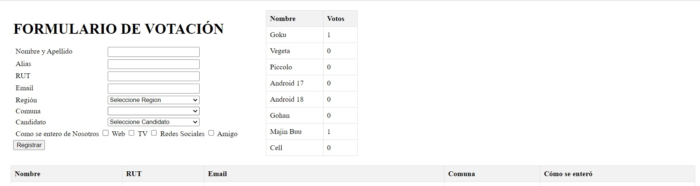

# Formulario de Votación

Este proyecto es un formulario de votación creado con los siguientes lenguajes de programación: HTML, JavaScript y PHP. Utiliza el patrón de diseño MVC (Modelo-Vista-Controlador).

## Contenido

- **Script de Creación de Base de Datos para phpMyAdmin:** Incluido en el repositorio, este script te permite crear la base de datos necesaria para el formulario en phpMyAdmin.

- **Patrón de Diseño MVC:**
  - **Controladores:** Controlan la interacción entre el modelo de la base de datos y la vista.
  - **Modelos:** Contienen validadores para:
    - Rut
    - Correo electrónico
    - Campos vacíos
  - **Vista HTML:** La interfaz de usuario del formulario. Utiliza DOM de JavaScript para cargar etiquetas Select y FETCH/AJAX para enviar y recibir datos.
  
## Validaciones y Control de Excepciones

- Las validaciones están implementadas en las clases PHP para asegurar el correcto ingreso y envío de datos a la base de datos.
- Se incluye control de excepciones, los cuales se envían como respuesta al HTML en caso de errores.

## Instalación y Uso

1. Clona el repositorio en tu máquina local.
2. Ejecuta el script de creación de base de datos en phpMyAdmin para crear la base de datos necesaria.
3. Abre el proyecto en tu editor de código favorito y realiza las modificaciones necesarias según tus requisitos.
5. Copiar tu Proyecto a la Carpeta de XAMPP
6. Navega a la carpeta de instalación de XAMPP. Generalmente es C:\xampp\htdocs en Windows o /opt/lampp/htdocs en Linux.
    Copia tu proyecto (todos los archivos y carpetas) a esta carpeta.
    Por ejemplo, si tu proyecto se llama mi_proyecto, la estructura debería ser C:\xampp\htdocs\mi_proyecto o /opt/lampp/htdocs/mi_proyecto.
7. Abre los archivos de configuración de tu proyecto, conexionDB.php.
    - $servername = "localhost";
    - $username = "root"; // Por defecto, el usuario es 'root'
    - $password = ""; // Por defecto, la contraseña es vacía
    - $dbname = "nombre_de_tu_base_de_datos";

8. Abre el formulario en un navegador web para empezar a utilizarlo.
   - http://localhost:8080/formulariovotacion/Vista/forularioDeVotacion.html
